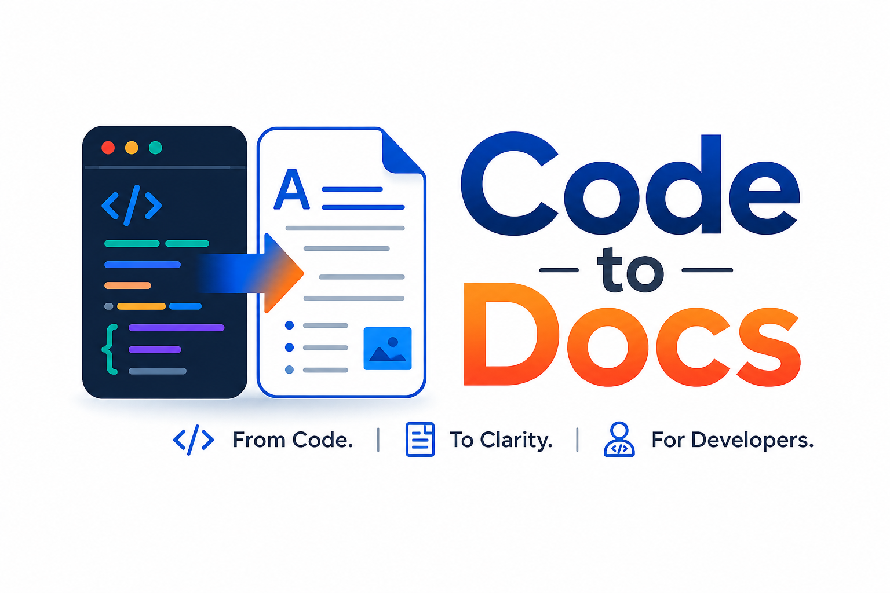

# code-to-docs

<p align="center">
  
</p>

<p align="center">
  <a href="https://github.com/nidhal-saadaoui/code-to-docs-skill/releases"></a>
  
  
  
</p>

A Claude Code skill that generates and updates documentation from an existing codebase.

## What it generates

| Subcommand   | Output                        | Description                                           |
|--------------|-------------------------------|-------------------------------------------------------|
| `readme`     | `README.md`                   | Project overview, quick start, usage, config          |
| `arch`       | `ARCHITECTURE.md`             | System design, component diagram, data flow           |
| `api`        | `docs/api.md`                 | API reference from routes, functions, or schemas      |
| `onboard`    | `ONBOARDING.md`               | Contributor setup, test commands, project layout      |
| `deployment` | `DEPLOYMENT.md`               | Build, deploy, env vars, health check, rollback       |
| `adr`        | `docs/adr/NNN-title.md`       | One Architecture Decision Record per major choice     |
| `update`     | edits existing docs in place  | Incremental update scoped to the current feature branch |

## Installation

```bash
git clone https://github.com/nidhal-saadaoui/code-to-docs-skill.git ~/.claude/skills/code-to-docs
```

To update to the latest version:

```bash
cd ~/.claude/skills/code-to-docs && git pull
```

Then invoke it in any project:

```
/code-to-docs readme
/code-to-docs arch
/code-to-docs api
/code-to-docs onboard
/code-to-docs deployment
/code-to-docs adr
/code-to-docs update
```

## Options

**Custom output directory** — tell the skill where to write files:
```
/code-to-docs readme — put it in docs/
```

**GitHub Wiki format** — use `[[Page Name]]` links and flat filenames:
```
/code-to-docs arch — for our GitHub wiki
```

## How it works

1. Detects the tech stack from manifest files (`package.json`, `go.mod`, `Cargo.toml`, `pom.xml`, etc.)
2. Reads existing documentation before writing — extends rather than overwrites
3. Uses inline docs (JSDoc, docstrings, Go doc comments) as authoritative source material
4. Asks targeted clarifying questions when decisions can't be inferred from code (at most 3, or 5 for ADRs)
5. For `update`: runs `git diff main...HEAD` to scope changes to the current feature branch only
6. Writes output using Claude Code's built-in tools — no external dependencies

## Structure

```
code-to-docs/
├── SKILL.md                   — workflow, subcommands, stack detection
├── references/
│   ├── readme-guide.md        — README rules per project type (library vs app vs CLI)
│   ├── architecture-guide.md  — component patterns and Mermaid diagram rules
│   ├── api-guide.md           — REST, GraphQL, and library API doc formats
│   ├── onboarding-guide.md    — contributor setup and test workflow guide
│   ├── deployment-guide.md    — deployment model detection and operator docs
│   ├── adr-guide.md           — ADR format, decision detection, and rationale handling
│   └── update-guide.md        — git-diff-scoped incremental update workflow
└── evals/
    └── evals.json             — 12 test cases covering all subcommands and output options
```

## Example output

The [`preview/`](preview/) directory contains a complete set of docs generated for a fictional project — showing exactly what each subcommand produces:

- [README.md](preview/README.md)
- [ARCHITECTURE.md](preview/ARCHITECTURE.md) — with Mermaid component diagram
- [docs/api.md](preview/docs/api.md) — endpoint reference with request/response examples
- [ONBOARDING.md](preview/ONBOARDING.md) — setup, test commands, writing a test
- [docs/adr/](preview/docs/adr/) — three Architecture Decision Records

## Requirements

Claude Code with access to `Bash`, `Read`, `Write`, and `Edit` tools. No other dependencies.
