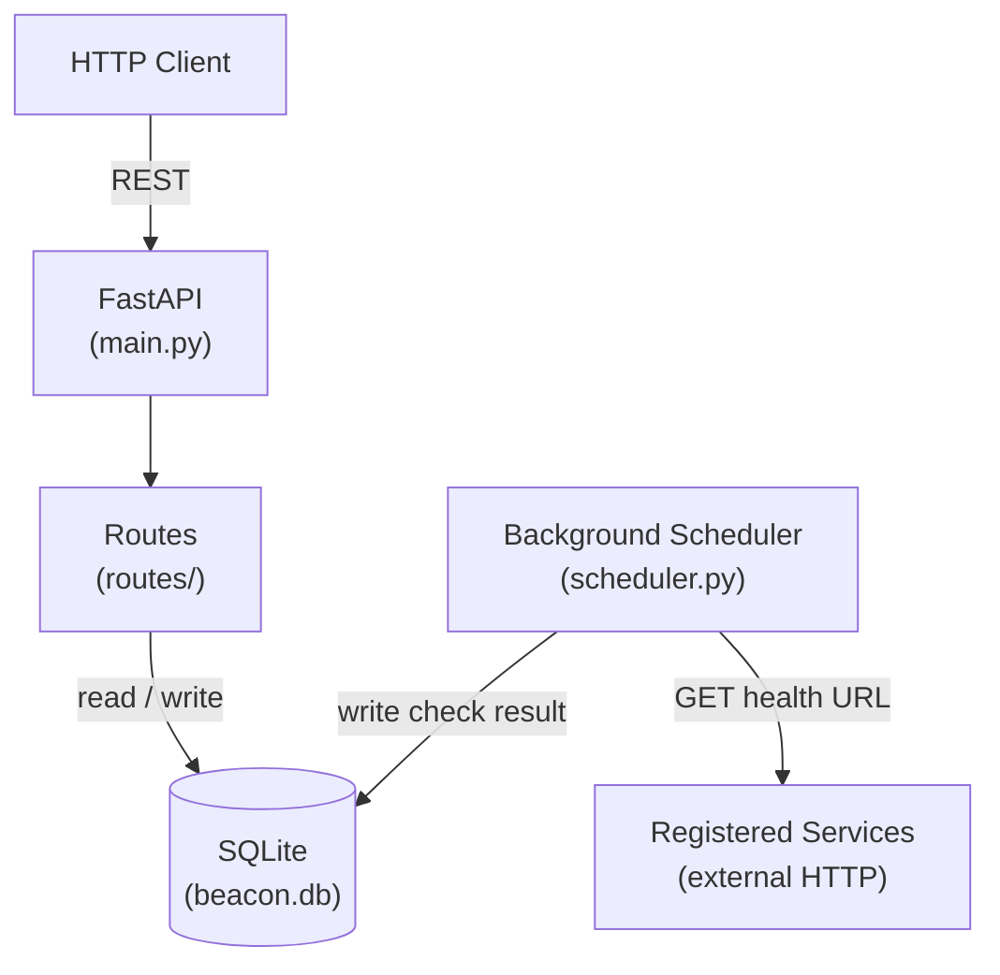

# Architecture

## Overview

Beacon is a single-process Python service that accepts service registrations over HTTP, polls each registered service on a configurable interval, and stores the results in a local SQLite database. It exposes the health history via a REST API.

## Component diagram

## Components

**FastAPI application** (`main.py`) — application entry point. Initialises the database connection pool, registers the route groups, and starts the background scheduler on startup. Shuts the scheduler down cleanly on SIGTERM.

**Routes** (`routes/`) — four route modules: `services.py` (register, list, delete), `health.py` (health history per service), `checks.py` (raw check records), and `status.py` (liveness endpoint). Each module receives the database session via FastAPI dependency injection.

**Background scheduler** (`scheduler.py`) — uses APScheduler to maintain one job per registered service. Each job fires an HTTP GET to the service's configured URL, records the status code and latency, and writes a `checks` row. Jobs are added and removed dynamically when services are registered or deleted via the API.

**Database layer** (`db/`) — aiosqlite with hand-written SQL. Two tables: `services` (id, name, url, interval\_seconds, created\_at) and `checks` (id, service\_id, timestamp, status\_code, latency\_ms, healthy). No ORM — the schema is small enough that raw SQL is easier to reason about than a migration graph.

## Data flow

A typical health check cycle:

1. Scheduler fires the job for service `payments-api`
2. `scheduler.py` issues `GET http://payments:8000/health` with a 5 s timeout
3. Response status code and elapsed time are written to the `checks` table
4. A client calls `GET /services/1/health` — the route queries the last N check records and computes an uptime percentage
5. The response is returned as JSON

## Testing approach

Tests are split into two layers:

- **Unit** (`tests/`) — test individual route handlers and the scheduler logic in isolation. The `client` fixture in `conftest.py` provides an async test client backed by an in-memory SQLite database seeded with a small fixture set. No network calls. Run with `pytest tests/`.
- **Integration** (`tests/integration/`) — spin up a real SQLite file and run a subset of scheduler jobs against a local stub server. Run with `pytest tests/integration/`.

The mock boundary is at the HTTP layer: unit tests replace outbound requests with `respx` mocks; integration tests use a real `httpx.AsyncClient` against a local `uvicorn` instance started by the test fixture.

No end-to-end browser tests exist — beacon has no frontend.

## Key decisions

**SQLite over PostgreSQL** — beacon's write pattern is append-only and low-frequency (one row per check per interval). SQLite handles this without connection pooling overhead and makes the service trivially deployable as a single binary with no external database. See [ADR-001](docs/adr/001-sqlite-over-postgresql.md).

**FastAPI over Flask** — the background scheduler shares the event loop with the HTTP server. An async framework eliminates the threading complexity that would arise from running APScheduler alongside a synchronous WSGI server. See [ADR-002](docs/adr/002-fastapi-over-flask.md).

**No authentication** — beacon is designed to run inside a private network, not exposed to the public internet. Adding auth would increase operational complexity (token rotation, secret management) for no practical security gain in the target deployment context. See [ADR-003](docs/adr/003-no-authentication.md).
