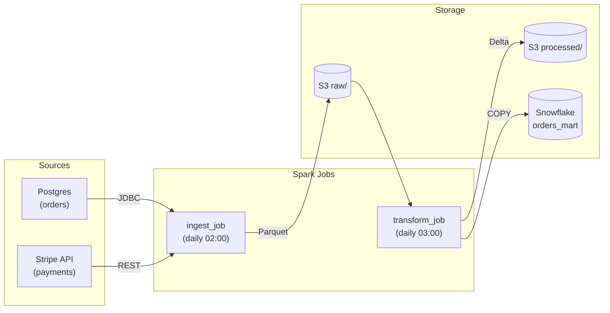
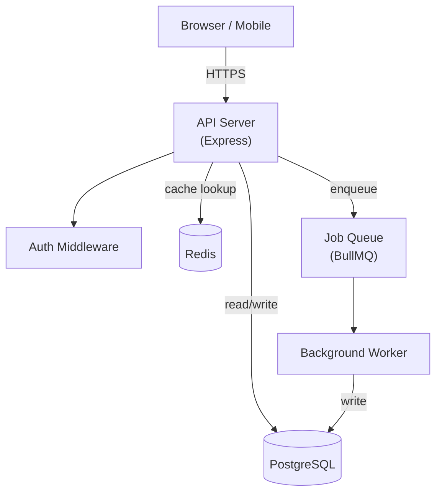
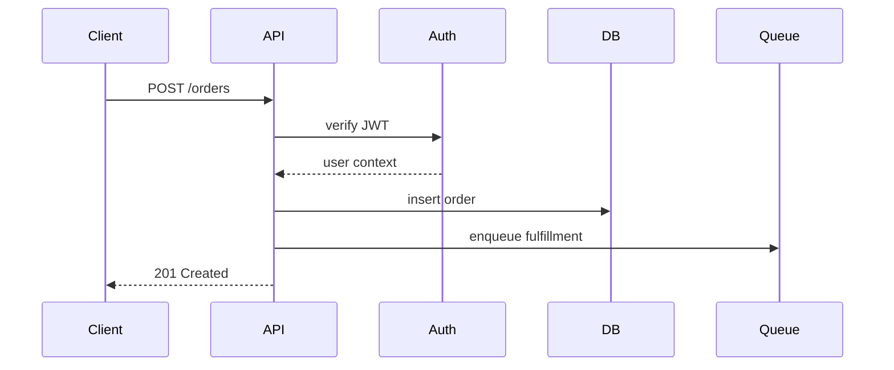

# Architecture Documentation Guide

## Goal

The reader should understand: what the major pieces are, how they relate, and why the structure exists. Not every file — the shape.

## Sections to include

1. **Overview** — 2-3 sentences: what the system does at the boundary (inputs → outputs), not how it works internally
2. **Component diagram** — Mermaid `graph TD` showing major components and their relationships
3. **Component descriptions** — one paragraph per major component explaining its responsibility
4. **Data flow** — how a request/event moves through the system from entry to exit
5. **Key decisions** — architectural choices that constrain future work (database choice, auth approach, async vs sync, etc.)
6. **External dependencies** — third-party services, databases, message queues the system relies on

Omit any section you cannot fill from the code. Never fabricate.

## Detecting architectural patterns

**Layered / MVC** — look for `controllers/`, `models/`, `views/`, `services/`, `repositories/`. Draw layers top-to-bottom.

**Microservices** — look for multiple `services/` directories, a `docker-compose.yml` with many service entries, or separate `apps/` in a monorepo. Draw each service as a node with labeled edges showing communication (HTTP, gRPC, message queue).

**Event-driven** — look for queue client imports (`kafka`, `rabbitmq`, `sqs`, `nats`, `redis streams`). Draw producers → queue → consumers.

**Monolith** — single process, one database. Draw the main modules as components inside one box.

**Serverless / functions** — look for `handler` exports, `serverless.yml`, `functions/` directory, AWS Lambda or Vercel config. Draw triggers → functions → downstream services.

**Data pipeline / big data** — look for these signals:

| Signal | Framework | How to draw it |
|---|---|---|
| `dags/`, `from airflow import DAG` | Apache Airflow | Tasks as nodes, dependencies as edges; group by DAG |
| `@flow`, `@task` from `prefect` | Prefect | Flows and tasks; note schedule and upstream dependencies |
| `@asset`, `@job` from `dagster` | Dagster | Asset graph: sources → assets → downstream consumers |
| `SparkSession`, `from pyspark` | Apache Spark | Pipeline stages: read → transform → write; note storage layers |
| `dbt_project.yml` | dbt | Lineage layers: sources → staging → intermediate → marts |
| `flink`, `DataStream`, `Table` | Apache Flink | Source → operator chain → sink |
| `ray`, `@ray.remote` | Ray | Actors and tasks; note distributed boundaries |

For pipeline architectures, prefer `graph LR` (left-to-right) over `graph TD` — it naturally represents data flowing through stages:

For the data flow section in a pipeline project, describe a full end-to-end run: what triggers the pipeline, what each stage reads and writes, and what the final consumer sees. Document schedules and SLAs if present in the orchestration config (cron expressions in DAG definitions, `schedule_interval`, etc.).

## Mermaid diagram rules

Keep diagrams readable:
- No more than 12-15 nodes
- Use subgraphs to group related components
- Label edges with the protocol or data type, not generic "calls"
- Prefer `graph TD` (top-down) for layered systems; `graph LR` (left-right) for pipelines

Example for a web service:

For sequence flows, use `sequenceDiagram` instead:

## What to look for in the code

- **Entry points**: `main.*`, `index.*`, `cmd/`, `app.*`, `server.*`
- **Routing**: `routes/`, `router.*`, controller annotations
- **Middleware**: anything wrapping the request handler chain
- **Data layer**: ORM models, repository classes, SQL files
- **External clients**: files that import HTTP clients, SDK clients, queue clients
- **Configuration**: how env vars are loaded and what they control
- **Background jobs**: cron, workers, consumers

## Testing approach section

Add a "Testing approach" section after component descriptions. Detect the test pyramid from directory structure and CI config — describe what's actually there, not what should ideally exist.

**Detect the layers from the codebase:**

| Signal | Layer |
|---|---|
| `tests/unit/` or files named `test_*.py` / `*.test.ts` next to source | Unit tests |
| `tests/integration/` or tests that import a DB client / HTTP client without mocking | Integration tests |
| `tests/e2e/`, `cypress/`, `playwright/` | End-to-end tests |
| `*.spec.ts` with `page.goto(...)` | Browser-level e2e |
| Property-based: `hypothesis`, `proptest`, `fast-check` | Property / fuzz tests |

**What to document:**

1. **What layers exist** — unit / integration / e2e, and roughly what each covers
2. **The mocking boundary** — what gets mocked at each layer (e.g. "unit tests mock the repository layer; integration tests hit a real SQLite instance")
3. **How to run each layer** — separate commands if they exist
4. **Notable gaps** — if routes, components, or modules have no corresponding tests, say so

**Format:**

~~~markdown
## Testing approach

Tests are split into two layers:

- **Unit** (`tests/`) — test individual <components> in isolation using
  in-memory fixture data. No external services required. Run with `<command>`.
- **Integration** (`tests/integration/`) — spin up a real <database/service>
  and exercise the full stack. Require `<setup command>` first.

The mock boundary is at the <layer> layer: unit tests inject a mock <dependency>,
integration tests use a real <service> initialized from the schema.

No end-to-end browser tests exist.
~~~

Fill in the placeholders from what you observe in the actual test files — do not leave `<component>` or similar in the output.

If CI runs different test commands per layer (e.g. `pytest tests/unit` and `pytest tests/integration` as separate jobs), document each separately and note whether they run in parallel.

## Key decisions section

For each major decision, write one brief paragraph:
- What was chosen (e.g., "PostgreSQL over MongoDB")
- What constraint or tradeoff drove the decision (if evident from the code or config)
- What it implies for future contributors (e.g., "all schema changes require a migration")

If you can't infer the reason from the code, add it to your pre-writing questions (see Step 3.5 in SKILL.md). Architectural decisions are the highest-value gap to surface — they're exactly what future contributors need and can't deduce themselves. If the user declines to answer, write the fact without the why: "Uses PostgreSQL" not "Chose PostgreSQL because...".
