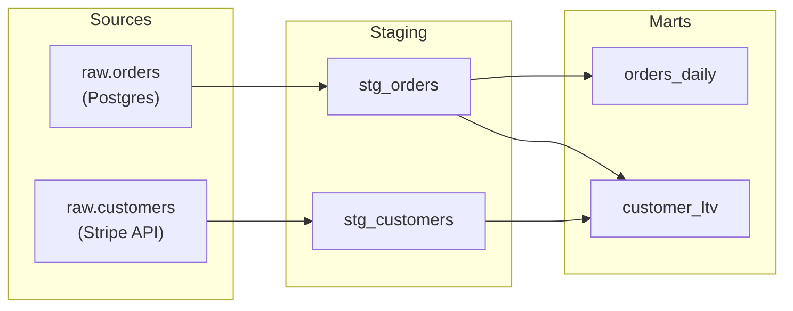
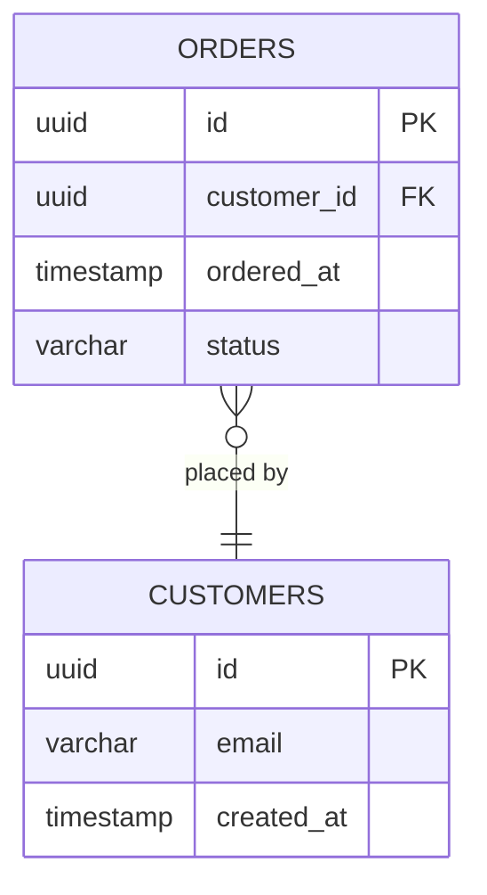

# Data Documentation Guide

## Goal

Document the data model, schema, and lineage so that a new engineer can understand what data exists, where it comes from, how it is transformed, and what each field means — without reading raw SQL or schema files.

## Output location

`docs/data.md` — create `docs/` if it doesn't exist.

## Sections to include

1. **Overview** — data stores used, number of tables/models, high-level domain split
2. **Lineage diagram** — how data flows from sources to serving layer (pipeline projects) or an ER diagram (relational schema projects)
3. **Sources** — external systems or raw tables that feed the pipeline
4. **Models / tables** — one subsection per logical group; for each table/model: fields, types, grain, update frequency, and any quality rules
5. **Data quality** — rules and checks if a framework is present
6. **Schema contracts** — Avro, Protobuf, or JSON Schema definitions if present

Omit sections with no content. Never speculate about fields or lineage not visible in the schema files or model definitions.

## Detect the data layer

Read these signals before deciding what to document:

| Signal | What it means |
|---|---|
| `dbt_project.yml` | dbt project — read `models/`, `sources.yml`, `schema.yml` |
| `models/staging/`, `models/marts/`, `models/intermediate/` | dbt layer structure — document each layer separately |
| `alembic/`, `migrations/*.py` | SQLAlchemy migrations — derive schema from migration history |
| `db/migrate/`, `*.rb` with `create_table` | Rails ActiveRecord migrations |
| `prisma/schema.prisma` | Prisma schema — authoritative source for models and relations |
| `flyway/`, `liquibase/` | SQL migration files — read them for schema |
| `*.avsc` | Avro schema — document record types and fields |
| `*.proto` | Protobuf schema — document messages and fields |
| `great_expectations/`, `expectations/` | Data quality suite — document expectation suites |
| `soda.yml` | Soda data quality checks |
| `dags/`, `flows/`, `jobs/` with schema definitions | Pipeline job schemas — document input/output datasets |

## dbt projects

dbt is the most common structured case. Read in this order:

1. `dbt_project.yml` — project name, model paths, materializations
2. `sources.yml` — source systems and raw tables with descriptions
3. `schema.yml` in each `models/` subdirectory — descriptions, column definitions, tests
4. The `.sql` files themselves — for models with no `schema.yml` entry, infer from the SQL

**Lineage diagram** — use `graph LR` to show the transformation layers:



**Per-model documentation** — for each model document:

```markdown
### stg_orders

**Materialization**: view
**Source**: `raw.orders` (Postgres `orders` table)
**Grain**: one row per order

| Column         | Type      | Description                            | Tests        |
|----------------|-----------|----------------------------------------|--------------|
| `order_id`     | varchar   | Surrogate key                          | unique, not_null |
| `customer_id`  | varchar   | FK to `stg_customers`                  | not_null     |
| `ordered_at`   | timestamp | UTC timestamp of order creation        |              |
| `status`       | varchar   | One of: pending, confirmed, cancelled  |              |
```

If `schema.yml` has a description for the model, use it. If column descriptions are missing, infer from the SQL — but note where inference was used.

## Relational schema (ORM / migrations)

For SQLAlchemy, Prisma, Django ORM, or raw SQL migrations:

1. Read the schema/model files to extract tables, columns, types, and constraints
2. Use `erDiagram` for the lineage diagram:



Keep ER diagrams under 10 entities. For large schemas, document the most central tables and note that the full schema is in the migration files.

## Avro / Protobuf / JSON Schema

For schema-first projects (Kafka pipelines, event-driven systems):

1. List each schema file and the event or record type it defines
2. Document top-level fields: name, type, whether nullable, description if present in the schema
3. Note the schema registry URL if referenced in config

## Data quality section

If Great Expectations or Soda is present:

- List the expectation suites or checks that exist
- For each suite, note what dataset it covers and what the critical checks are (not_null, unique, value ranges)
- Note how checks are triggered (CI, scheduled, on pipeline run)

Do not reproduce every check — summarise the coverage and flag any datasets with no quality checks.

## What NOT to document

- Internal intermediate columns not exposed downstream
- Auto-generated primary keys with no business meaning beyond uniqueness
- Columns whose names and types are fully self-explanatory (`created_at timestamp`, `updated_at timestamp`)
- Migration history steps — document the current schema state, not how it got there
